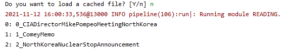
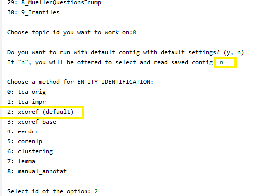

# XCoref: Cross-document coreference resolution (CDCR) in the wild

An end-to-end CDCR system aiming at resolving entity, event, and more abstract concepts with a word choice and labeling diversity
 from a set of related articles.  
 
 To cite the related publications, please use: 
 ```
 @inproceedings{Zhukova2022,
author = {Zhukova, Anastasia and Hamborg, Felix and Donnay, Karsten and Gipp, Bela},
title = {XCoref: Cross-Document Coreference Resolution in the Wild},
year = {2022},
isbn = {978-3-030-96956-1},
publisher = {Springer-Verlag},
address = {Berlin, Heidelberg},
url = {https://doi.org/10.1007/978-3-030-96957-8_25},
doi = {10.1007/978-3-030-96957-8_25},
booktitle = {Information for a Better World: Shaping the Global Future: 17th International Conference, IConference 2022, Virtual Event, February 28 – March 4, 2022, Proceedings, Part I},
pages = {272–291},
numpages = {20},
keywords = {News analysis, Media bias, Cross-document coreference resolution}
}
 ```
 
 ```
@inproceedings{Zhukova2021,
author = {Zhukova, Anastasia and Hamborg, Felix and Donnay, Karsten and Gipp, Bela},
title = {Concept Identification of Directly and Indirectly Related Mentions Referring to Groups of Persons},
year = {2021},
isbn = {978-3-030-71291-4},
publisher = {Springer-Verlag},
address = {Berlin, Heidelberg},
url = {https://doi.org/10.1007/978-3-030-71292-1_40},
doi = {10.1007/978-3-030-71292-1_40},
booktitle = {Diversity, Divergence, Dialogue: 16th International Conference, IConference 2021, Beijing, China, March 17–31, 2021, Proceedings, Part I},
pages = {514–526},
numpages = {13},
keywords = {Media bias, News analysis, Coreference resolution},
location = {Beijing, China}
}
 ```

### Environment and installation
Requires **Python 3.6**

Clone the repository, install required packages and resources via pip. 

```
pip install requirements.txt
python setup.py
```
Some troubleshooting information is found [here](INSTALLATION.md).

### Stanford CoreNLP Server
Next, execute the following to automatically set up the Stanford CoreNLP server and keep it running. It needs to be 
running during the main code execution. The start-up takes some time and only when finished, the newsalyze should be executed. 
Once the message `[main] INFO CoreNLP - StanfordCoreNLPServer listening at /0:0:0:0:0:0:0:0:9000` appears, you're ready to go.
```
python start_corenlp.py
```

### EECDCR: CDCR model by Barhom et al. 
If you want to use a CDCR model by Barhom et al. (EECDCR) (see https://www.aclweb.org/anthology/P19-1409/), 
you must follow additional setup instructions [here](cdcr/entities/eecdcr/README.md).

## Run the analysis
To start the end-to-end execution, run:
```
python start_end_to_end_pipeline.py
```
After the pipeline was started, you will need to choose a collection of news articles, which you want to analyse: 



At the next question, choose "n" if you want to execute the pipeline from the very beginning and "y" if you have already 
executed the pipeline and it has cached the intermediate results, which you want to restore.

Then, the pipeline will ask you to choose methods for the pipeline. To choose default parameters, answer "y". If you want to 
explore what are the other methods implemented for the pipeline modules, choose "n". For each module you will be offered a 
list of available methods. The default option will be marked in the selection list: 



Select "n" to avoid caching the execution parameters.

Lastly, choose which mentions you want to resolve: automatically extracted (end-to-end system) or manually annotated for this topic: 


On a 64 GB of RAM and 2.8GHz, running the default pipeline on a small dataset of five news articles requires:
 1) TCA  ~25 minutes 
 2) XCoref ~50 minutes
 3) EECDCR ~ 6 hours
 Minimum RAM required: 16 Gb
 
 ## Run the evaluation of CDCR methods
To replicate the numbers reported in the paper, start the following script:
```
python start_multiple_pipelines.py
```

You can vary the experiments to run in the file ```cdcr/evaluation/experiments_all.csv```. After the execution of the 
script is over, execute ```cdcr/evaluation/evaluation.py``` to collect the evaluation metrics. 
